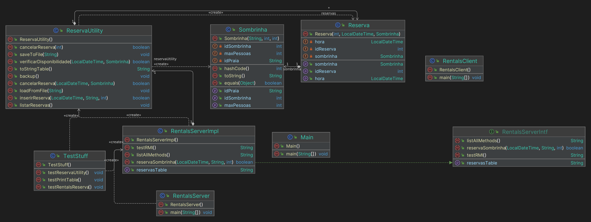

# CpaBackend

## Project Description
Backend do projecto de CD. Contém o RMI Server e trata da persistencia dos dados por via de ficheiros.

- Package Server: RMI Server
- Package Client: RMI Client para testes 
- Package Reservations: Classes de dados - Ler e escrever para ficheros

## Instructions
1. Run: 
```bash
./build.sh
```
2.Run the server:
```bash
java -jar rmi_server.jar
```

3. Run the test client:
```bash
java -jar rmi_cliente.jar localhost
```

## Em docker
1. Build:
```bash
docker-compose build
```
2. Run:
```bash
docker-compose up
```

### Todo
- [ ] Verificar: Consistencia com a persistencia de dados.
- [ ] Issue: Cancelamento de reservas esta a gerar ids novos a cada cancelamento por faz sempre um backup e le de novo para o TreeMap reservas
- [ ] Todo: Metodos inserirReserva e verificarDisponibilidade da ReservaUtility devem retornar id da reserva
- [ ] Todo: Solve issue dos ids unicos e finais das reservas - gravar e ler em ficheiro
  - A meio de tratar no metodo inserirReserva da ReservaUtility
- [ ] Work on server logs: methods calls, errors, etc
  

#### Helpers
# Java RMI
```bash
watch -n 1 'sudo netstat -pnlt | grep 1099'
```

# localhost port traffic monitoring
```bash
sudo tcpdump -i lo -n -s 0 -w - | grep -a -o -E "Host\: .*|GET \/.*"
```

# Current Project Structure

